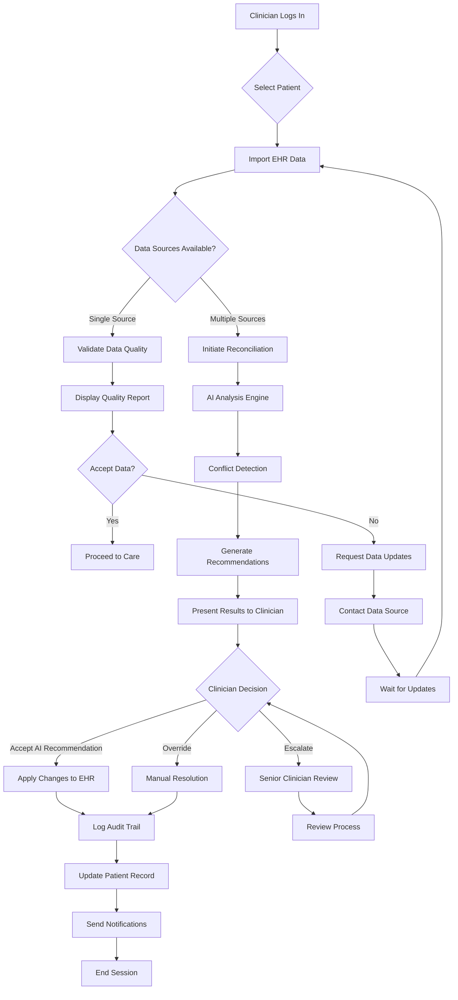
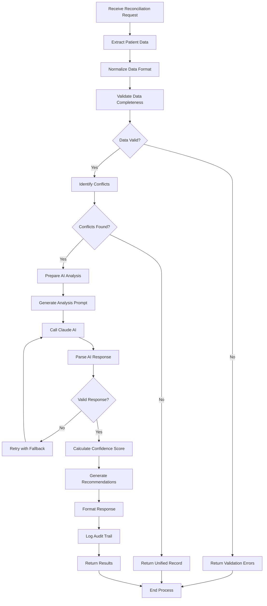
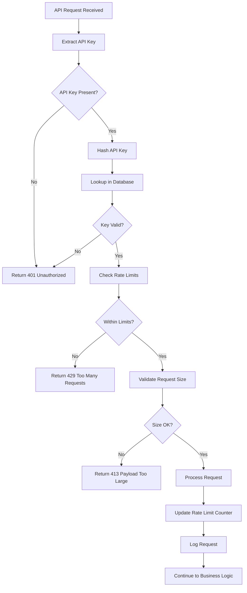
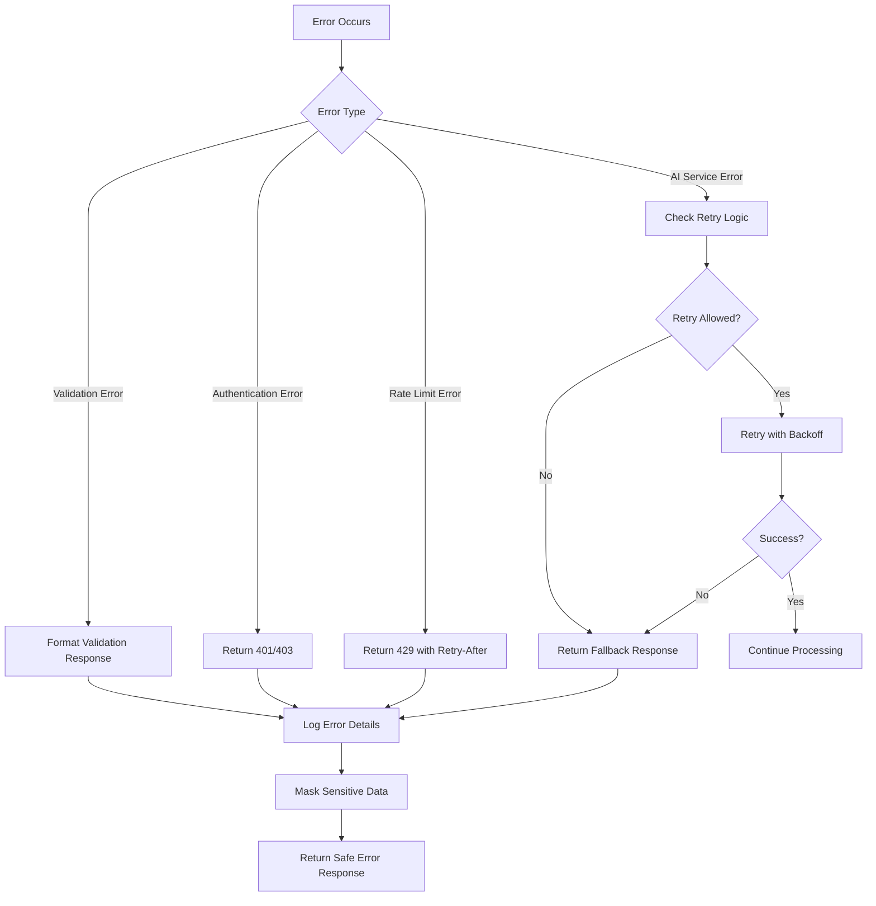
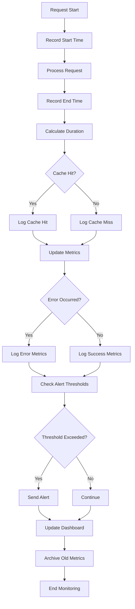
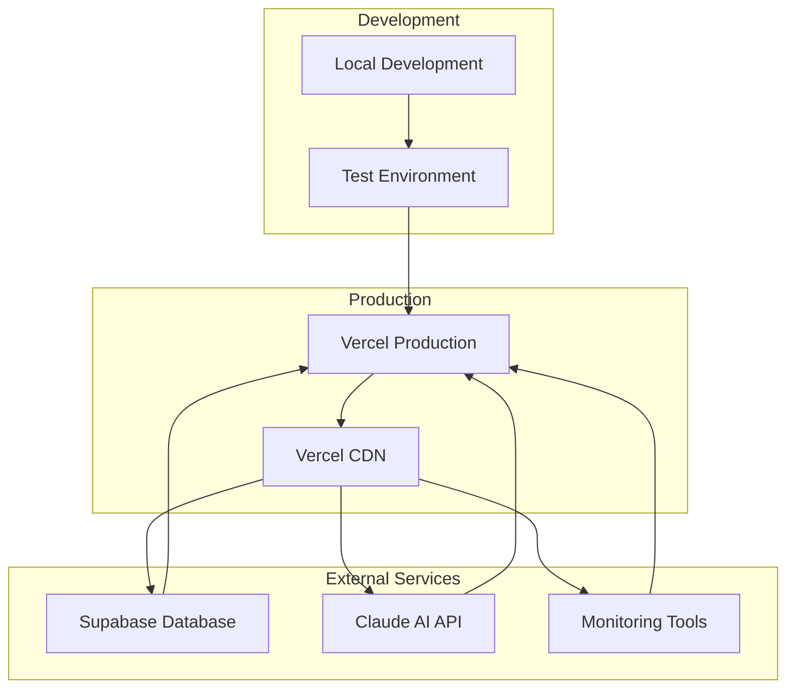

# Application Flow & Architecture

## MediSync User Journey



## System Architecture Flow

```mermaid
flowchart LR
    subgraph "Client Layer"
        UI[Web Dashboard]
        API[REST API Client]
    end

    subgraph "API Gateway Layer"
        AUTH[Authentication Middleware]
        RATE[Rate Limiting]
        VALID[Request Validation]
    end

    subgraph "Business Logic Layer"
        RECONCILE[Reconciliation Engine]
        QUALITY[Quality Validator]
        CACHE[Response Cache]
    end

    subgraph "AI Processing Layer"
        CLAUDE[Claude AI Service]
        PROMPT[Prompt Engineering]
        PARSER[Response Parser]
    end

    subgraph "Data Layer"
        SUPABASE[(Supabase PostgreSQL)]
        AUDIT[Audit Logs]
        METRICS[Performance Metrics]
    end

    UI --> API
    API --> AUTH
    AUTH --> RATE
    RATE --> VALID

    VALID --> RECONCILE
    VALID --> QUALITY

    RECONCILE --> CACHE
    CACHE --> CLAUDE
    CLAUDE --> PROMPT
    PROMPT --> PARSER

    QUALITY --> SUPABASE
    RECONCILE --> SUPABASE
    PARSER --> SUPABASE

    SUPABASE --> AUDIT
    SUPABASE --> METRICS
```



## Data Reconciliation Process Flow



## Authentication & Security Flow



## Error Handling Flow



## Performance Monitoring Flow



## Deployment Architecture



## Component Interaction Diagram

```mermaid
graph TB
    subgraph "Frontend Components"
        DASHBOARD[Dashboard]
        RECONCILE_VIEW[Reconciliation View]
        QUALITY_VIEW[Quality View]
        AUDIT_VIEW[Audit View]
    end

    subgraph "API Routes"
        RECONCILE_API[/api/reconcile]
        QUALITY_API[/api/validate]
        AUDIT_API[/api/admin]
    end

    subgraph "Business Services"
        RECONCILE_SERVICE[Reconciliation Service]
        QUALITY_SERVICE[Quality Service]
        CACHE_SERVICE[Cache Service]
    end

    subgraph "External Services"
        CLAUDE_SERVICE[Claude AI]
        DB_SERVICE[Database]
        LOG_SERVICE[Logging]
    end

    DASHBOARD --> RECONCILE_VIEW
    DASHBOARD --> QUALITY_VIEW
    DASHBOARD --> AUDIT_VIEW

    RECONCILE_VIEW --> RECONCILE_API
    QUALITY_VIEW --> QUALITY_API
    AUDIT_VIEW --> AUDIT_API

    RECONCILE_API --> RECONCILE_SERVICE
    QUALITY_API --> QUALITY_SERVICE
    RECONCILE_API --> CACHE_SERVICE
    QUALITY_API --> CACHE_SERVICE

    RECONCILE_SERVICE --> CLAUDE_SERVICE
    RECONCILE_SERVICE --> DB_SERVICE
    QUALITY_SERVICE --> DB_SERVICE

    RECONCILE_SERVICE --> LOG_SERVICE
    QUALITY_SERVICE --> LOG_SERVICE
    CACHE_SERVICE --> LOG_SERVICE
```